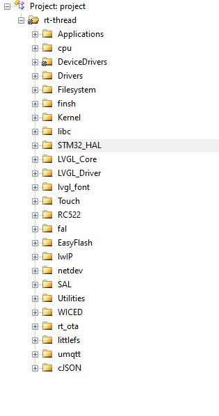

## mqtt服务器:使用emqx作为mqtt服务器

#### 	教程：https://docs.emqx.cn/broker/v4.3/#%E5%BC%80%E5%A7%8B%E4%BD%BF%E7%94%A8

## 人脸识别：使用百度的人脸识别功能，需要注册账号和实名认证，免费使用的

## 会限速，识别一张照片要一秒左右，只用到人脸搜索和人脸库管理功能

#### 	教程：https://ai.baidu.com/ai-doc/FACE/7k37c1twu

## rt-thread教程：

#### 	内核视频教程：https://www.rt-thread.org/page/video.html

#### 	内核实验手册：https://www.rt-thread.org/document/site/rt-thread-version/rt-thread-standard/tutorial/experimental-manual/experimental-manual.pdf

#### 	rt-thread文档中心：https://www.rt-thread.org/document/site/#/rt-thread-version/rt-thread-standard/README

## LVGL教程：

#### 	移植教程：https://blog.csdn.net/qq_40831286/article/details/107633216

#### 	LVGL中文教程手册文档：http://lvgl.100ask.org/7.11/index.html

## Applications：各设备应用程序

## cpu、Kernel：rt-thread内核

## DeviceDrivers、Drivers：spi、DCMI、SD等rt-thread自带设备驱动

## Filesystem、fal、EasyFlash、littlefs：flash、SD文件系统所需文件

## finsh：控制台

## libc：rt-thread组件

### STM32_HAL：STM32H7HAL库

## LVGL_Core、LVGL_Driver、lvgl_font：lvgl嵌入式GUI界面程序

## Touch：触摸驱动

## RC522：RC522驱动

## lwIP、netdev、SAL、umqtt：网络设备协议底层和中间层

## Utilities、rt_ota：文件传输组件，用于更新wifi蓝牙固件

## WICED：wifi6212函数库

## cJSON：json库